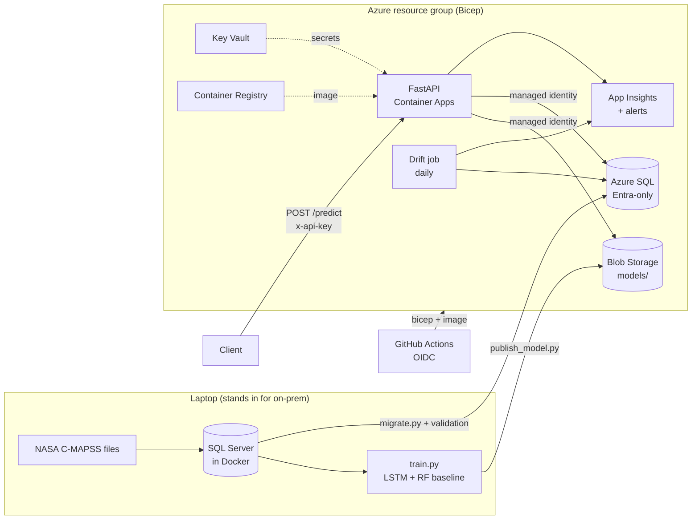

# Predictive Maintenance API on Azure

[](https://github.com/CosmicShadow/predictive-maintenance-api/actions/workflows/deploy.yml)

Predicts how many cycles a jet engine has left before failure (**remaining useful life**, RUL)
from its recent sensor readings, using NASA's C-MAPSS turbofan dataset (FD001). A PyTorch LSTM
is trained and compared against a scikit-learn baseline. It is served by a FastAPI service on
Azure Container Apps, with every prediction logged to Azure SQL and a daily model-drift check.



## How each requirement is covered

| # | Requirement | Where it lives |
|---|---|---|
| 1 | Design, build, test, deploy ML models and AI apps | [`train.py`](src/rul/train.py), [`model.py`](src/rul/model.py), [`tests/`](tests), [`api.py`](src/rul/api.py) |
| 2 | Data science → production AI | Model packaged with its normalizer and metadata ([`predictor.py`](src/rul/predictor.py)), containerized ([`Dockerfile`](Dockerfile)), tested and monitored |
| 3 | Python and SQL | [`sql/001_schema.sql`](sql/001_schema.sql), [`sql/queries.sql`](sql/queries.sql), training data pulled with SQL, predictions logged to SQL |
| 4 | TensorFlow / PyTorch | PyTorch LSTM + scikit-learn random forest baseline ([`baseline.py`](src/rul/baseline.py)) |
| 5 | Build and deploy AI on a cloud | Azure Container Apps + Azure SQL + Blob Storage |
| 6 | Virtualized and cloud systems | SQL, Storage, Key Vault, Container Apps, registry, monitoring all in [`infra/main.bicep`](infra/main.bicep) |
| 7 | On-prem to cloud migration | [`migrate.py`](src/rul/migrate.py), [`validate_migration.py`](src/rul/validate_migration.py), [runbook](docs/migration-runbook.md) |
| 8 | Automation | [`ci.yml`](.github/workflows/ci.yml), [`deploy.yml`](.github/workflows/deploy.yml), Bicep |
| 9 | Security compliance | Managed identity, Key Vault, Entra-only SQL, [Azure Policy](infra/policies.bicep), [Defender review](docs/defender-review.md), [SECURITY.md](SECURITY.md) |
| 10 | Monitoring | App Insights telemetry, 3 alert rules, [drift check](src/rul/drift.py) |

## Repository layout

```
src/rul/            Python package
  data.py             read C-MAPSS, RUL labels, feature selection, windowing
  features.py         normalizer + window padding (shared by training and serving)
  model.py            PyTorch LSTM
  baseline.py         scikit-learn random forest baseline
  train.py            train + evaluate both models, save artifacts
  predictor.py        load a saved model and predict
  api.py              FastAPI service
  drift.py            PSI drift check (runs as a Container Apps job)
  db.py               SQL Server / Azure SQL connections (Entra token, no passwords in Azure)
  load_to_sql.py      load raw files into the local "on-prem" SQL Server
  migrate.py          local SQL Server -> Azure SQL
  validate_migration.py  row counts, checksums, spot checks
  publish_model.py    upload model to Blob Storage, register in SQL
sql/                schema, least-privilege grants, example queries
infra/              Bicep (main + policies) and parameter file
.github/workflows/  CI (lint, tests, Bicep build, image build) and deploy
scripts/            dataset download, traffic replay / drift simulation
docs/               Azure setup, migration runbook, Defender review
```

---

## Part 1: Run it locally

### Prerequisites (Windows)

```powershell
winget install Python.Python.3.12
winget install Docker.DockerDesktop
winget install Microsoft.AzureCLI
```

Also install **Microsoft ODBC Driver 18 for SQL Server** (x64) from
<https://learn.microsoft.com/sql/connect/odbc/download-odbc-driver-for-sql-server>.

### 1. Python environment and tests

```powershell
py -3.12 -m venv .venv
.\.venv\Scripts\Activate.ps1
pip install -e ".[train,dev]"
pytest
```

### 2. Data into the local SQL Server ("on-prem")

```powershell
copy .env.example .env          # then set LOCAL_SQL_PASSWORD in .env
python scripts/download_data.py
docker compose up -d sqlserver
```

Load the `.env` values into your shell. The Python scripts read environment variables:

```powershell
Get-Content .env | Where-Object { $_ -match '^\w+=' } | ForEach-Object { $k, $v = $_ -split '=', 2; Set-Item "env:$k" $v }
```

```powershell
python -m rul.apply_sql sql/000_create_database.sql --target local --database master
python -m rul.apply_sql sql/001_schema.sql --target local
python -m rul.load_to_sql
```

### 3. Train

```powershell
python -m rul.train            # reads training data from SQL; under a minute on a laptop CPU
```

The script prints test RMSE for the baseline and the LSTM, and writes `artifacts/model/`
(weights, `meta.json`, `metrics.json`, `test_predictions.png`). Add `--source files` to skip SQL.

### 4. Serve

```powershell
$env:MODEL_DIR = "artifacts/model"; $env:SQL_TARGET = "local"
uvicorn rul.api:app --port 8000
```

Open <http://localhost:8000/docs> for the interactive API page. In a second terminal:

```powershell
python scripts/send_traffic.py --url http://localhost:8000 --count 20
```

Or run the API container itself: `docker compose --profile api up --build`.

---

## Part 2: Deploy to Azure

Follow [docs/azure-setup.md](docs/azure-setup.md). In short:

1. Create the resource group and a GitHub OIDC identity, then set the repo variables.
2. Deploy the foundation with Bicep (registry, SQL, storage, Key Vault, monitoring, policy).
3. **Migrate**: `python -m rul.migrate` copies the local database to Azure SQL and validates it
   (see the [runbook](docs/migration-runbook.md)).
4. Grant the API identity its SQL permissions: `sql/002_grant_api_identity.sql`.
5. Publish the model: `python -m rul.publish_model --register`.
6. Push to `main`. GitHub Actions tests, builds, pushes the image, deploys the app and smoke-tests it.
7. Send traffic, watch App Insights, then simulate drift with `--drift-pct 1` and run the drift job.

## API

| Method | Path | Auth | Purpose |
|---|---|---|---|
| GET | `/health` | none | liveness probe |
| GET | `/ready` | none | 200 once a model is loaded |
| GET | `/model` | `x-api-key` | model version, features, test metrics |
| POST | `/predict` | `x-api-key` | predict RUL from an engine's recent cycles |

```json
POST /predict
{
  "unit_id": 31,
  "cycles": [
    {"s2": 642.58, "s3": 1581.22, "s4": 1398.91, "s7": 554.42, "s8": 2388.08, "s9": 9056.40,
     "s11": 47.23, "s12": 521.79, "s13": 2388.06, "s14": 8130.11, "s15": 8.4024,
     "s17": 393, "s20": 38.81, "s21": 23.3552}
  ]
}
```

Send up to the last 30 cycles, oldest first. Fewer are accepted and padded. Extra fields are ignored.

## Results

FD001, seed 42, trained on a laptop CPU in about 30 seconds (17 epochs, early stopping):

| Model | Test RMSE (cycles) | Test MAE | NASA score |
|---|---|---|---|
| Random forest baseline | 16.61 | 12.82 | 492.2 |
| PyTorch LSTM | **13.84** | **10.43** | **299.4** |

The LSTM's test RMSE is 17% lower than the baseline's. The deployed API reproduces the same
13.84 RMSE when the 100 test engines are sent through `/predict`.

RMSE is measured against the true RUL of the 100 FD001 test engines, capped at 125 like the
training target. `metrics.json` also reports RMSE against the uncapped truth.

## Cost

With the SQL Database free offer and Container Apps scaling to zero, this runs for roughly the cost
of the Basic container registry (about $5/month) plus cents for storage, Key Vault and logs. Delete
everything when you're done:

```powershell
az group delete --name rg-rulpm --yes
```
